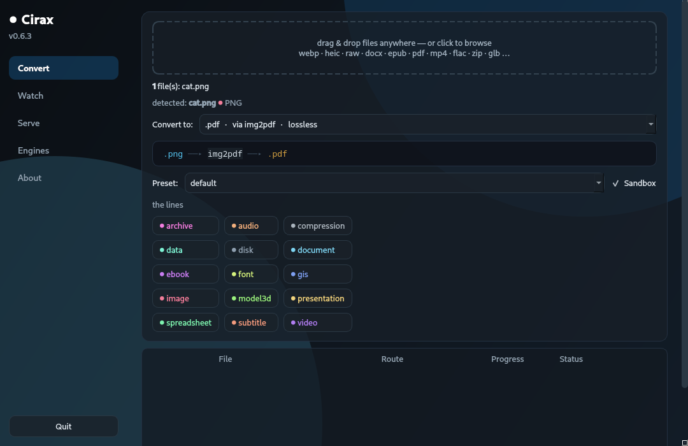
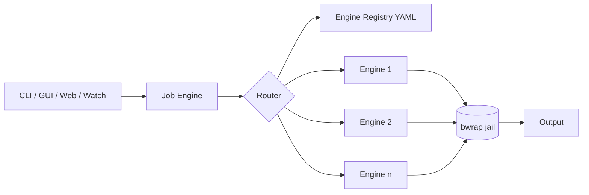

<div align="center">
  
  <p>
    <a href="https://pypi.org/project/cirax/"></a>
    
    
    
    <a href="https://github.com/baselanaya/Cirax/actions"></a>
  </p>
  <p><b>The universal converter for people who read the privacy policy.</b><br>
  Don't upload. Convert.</p>
</div>

<div align="center">
  
  <p><sub>The convert page: drop files, and the target list is built from what
  they actually are — each entry shows the engine chain and its loss tag.</sub></p>
</div>


---

**Cirax** turns your Linux machine into a conversion hub. One command reaches
every format — not because Cirax reimplements codecs, but because it routes
between the best engines ever written (FFmpeg, libvips, ImageMagick,
LibreOffice, Pandoc, Calibre, 7-Zip, qpdf…) and chains them automatically.
Files never leave your disk. Ever.

## The Problem

1. **Every online converter is a data breach waiting to happen.** Your
   contracts, IDs, medical scans and family photos, uploaded to an anonymous
   ad-riddled server.
2. **Local tools are islands.** ffmpeg alone has a 40-page manual; LibreOffice
   won't talk to ImageMagick; your HEIC stays HEIC.
3. **Format-pair explosions.** 109 formats × 109 formats = 11,881 possible
   converters. Nobody writes those.

## The Product

```console
$ # what used to require three websites and a leap of faith:
$ cirax convert report.docx preview.png
● converting report.docx: application/vnd...document → image/png
  (libreoffice → pdftoppm, lossy)

$ # speech to subtitles, offline:
$ cirax convert talk.mp3 talk.srt

$ # AI-grade OCR — a 1.3B-parameter vision model, fully local:
$ cirax convert scan.png text.txt
```

## Core Features

- **Chain router** — a Dijkstra search over a 109-format graph picks the best
  chain of engines for any pair, ranked by fidelity (`lossless` beats `lossy`)
  and tagged before it runs.
- **58 engines, one grammar** — a declarative YAML registry wraps each engine;
  adding a format is a stanza, not a pull request.
- **Sandboxed by default** — every job runs in a [bubblewrap](https://github.com/containers/bubblewrap)
  jail: no network, read-only filesystem, writes confined to the workspace.
- **Local AI OCR** — [GLM-OCR](https://huggingface.co/zai-org/GLM-OCR) (MIT,
  ~1.3B params) via Ollama: layout-aware text + Markdown, zero cloud.
- **Same-format ops** — strip EXIF/GPS, fix line endings, transcode charsets.
- **Watch & serve** — convert folders as files land in them, or drive it from
  a local web UI / plain curl.

## Quick Start

### Installation

| Channel | Command |
|---|---|
| PyPI | `uv tool install cirax` (or `pipx install cirax`) |
| curl | `curl -fsSL https://raw.githubusercontent.com/baselanaya/Cirax/main/install.sh \| sh` |
| npm | `npm i -g @baselanaya/cirax` |
| Windows | `Cirax-Setup-win64.exe` from [Releases](https://github.com/baselanaya/Cirax/releases) (desktop app + CLI). Engines: `cirax doctor --show-missing` prints scoop/winget commands; extra engines in `scoop bucket add cirax https://github.com/baselanaya/Cirax` |
| Desktop (Linux) | grab the `.deb` / `.rpm` / `.AppImage` from [Releases](https://github.com/baselanaya/Cirax/releases) |
| macOS | `Cirax-macos.dmg` from [Releases](https://github.com/baselanaya/Cirax/releases) (experimental — unsigned, right-click → Open) |

Cirax itself is tiny — the engines are your system packages. `cirax doctor
--show-missing` prints exactly what to install.

### First conversion

```sh
cirax doctor              # capability matrix of this machine
cirax plan report.docx    # every reachable target, with routes
cirax convert report.docx preview.png
```

### Desktop app

Drag, drop, convert. The GUI speaks to the same sandboxed pipeline as the CLI
and ships in every release artifact.

### Engine installation

| Domain | pacman packages |
|---|---|
| Images | `libvips imagemagick libheif libjxl libavif libwebp oxipng pngquant` |
| Video / Audio | `ffmpeg mkvtoolnix-cli sox opus-tools gifsicle` |
| Office | `libreoffice-still pandoc` |
| Ebooks | `calibre` |
| PDF | `qpdf ghostscript poppler img2pdf ocrmypdf` |
| Archives | `7zip zstd unar libisoburn` |
| Data | `jq go-yq miller duckdb` |
| RAW / Vector | `darktable inkscape librsvg potrace` |
| 3D / Disks / GIS | `assimp qemu-img gdal` |
| AI | `ollama` + `ollama pull glm-ocr` |

## Architecture



The complete machine-readable format map lives at [docs/FORMATS.md](docs/FORMATS.md) (auto-generated from the registry).

Inputs are detected with `file(1)` + an extension table; the router searches
the capability graph up to three hops through pivot formats (PDF, PNG, WAV,
JSON…); a job engine runs the chain inside a sandbox with per-engine
concurrency, progress parsing and guaranteed cleanup.

## Cirax vs. Online Converters

| | Online converters | Cirax |
|---|---|---|
| Your files | uploaded to someone's server | never leave the disk |
| Format pairs | a hand-picked menu | the closure of 58 engines (chains) |
| Fidelity | whatever it feels like | tagged `lossless`/`lossy` before running |
| OCR / AI | extra fee, extra upload | GLM-OCR locally, after one `ollama pull` |
| Works offline | no | completely |
| Sandboxing | n/a | bubblewrap, no network, per job |

## Supported Platforms

| Platform | Status | Notes |
|---|---|---|
| Linux x86_64 (Arch, Ubuntu, Fedora…) | ✅ supported | engines via your package manager |
| AppImage / deb / rpm | ✅ released | desktop app + CLI in every release |
| Windows / macOS | ❌ not yet | engine discovery needs porting |

## Contributing

Fork → branch (`feat/…`) → PR. Adding a conversion engine is a YAML stanza —
see [README section on engines](#adding-an-engine) in the docs and the
existing specs under `src/cirax/data/engines/`.

## Adding an Engine

Drop a YAML stanza in `src/cirax/data/engines/` — inputs, outputs, a command
template, optional per-format flags and presets — and the router picks it up.
No code.

```yaml
- engine: mycodec
  binary: mycodec
  package: mycodec
  presets:
    web: {flags: {image/myfmt: "-q 70"}}
  routes:
    - from: [image/png]
      to: [image/myfmt]
      lossless: true
      priority: 90
      command: "mycodec encode {input} {flags} {output}"
```

---

Built by Basel Anaya — Maximlabs.co

<div align="center"><sub>Don't upload. Convert.</sub></div>
